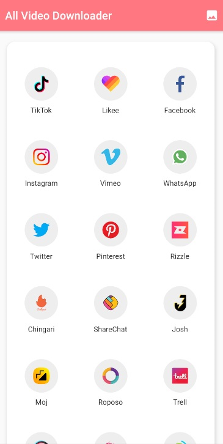

# All Video Downloader

This is Flutter based project which let's you download Video's directly from most of the famous Video Sharing Platforms.

# Introduction

You want to download a particular video and you want it right away. We get it, that’s why our all video downloader app enables you fast and flawless experience where you just need to copy-paste the URL from the most famouse social media websites (Facebook, Instagram, Twitter, Whatsapp) to download and save the video. Download & keep the videos – go back and view them whenever you want – the video downloader indeed offers a great media player that enhances the viewing experience.

## Getting Started

First of All you need to Download the apk file and Install it on your mobile Phone.

Everything that could help you in using the application is mentioned in the Screens of the applications, Application is build very smooth and will provide you a Great UI/UX Experience.

# Screenshots

Some Screens Of the Application are provided Below.

#Splash Screen 

 

# Screens 

   

# Seperate Gallery for Every Application

  
